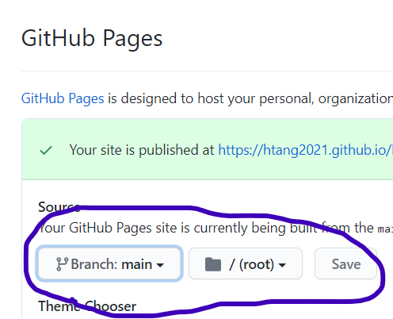

# My Porfolio - A Developer's Porfolio
Legal & Copyright statements

# Project Objective
This project is to create an employee's porfolio page template (a website) that meets the content and UX requirements, with the mock-up provided as a baseline.  

# Design Requirements
- GIVEN I need to sample a potential employee's previous work

- WHEN I load their portfolio
- THEN I am presented with the developer's name, a recent photo, and links to sections about them, their work, and how to contact them

- WHEN I click one of the links in the navigation
- THEN the UI scrolls to the corresponding section

- WHEN I click on the link to the section about their work
- THEN the UI scrolls to a section with titled images of the developer's applications

- WHEN I am presented with the developer's first application
- THEN that application's image should be larger in size than the others

- WHEN I click on the images of the applications
- THEN I am taken to that deployed application

- WHEN I resize the page or view the site on various screens and devices
- THEN I am presented with a responsive layout that adapts to my viewport

# Mock-up image of Porfolio page
Mock-up image of the site is as follows:

# Github Repository
All files and changes made are located on github at the following location:

https://github.com/htang2021/htang-porfolio

A copy of this README.md file is also at the github location.

# Application Live URL
https://htang2021.github.io/htang-porfolio/

# Deploy Your Project

This instruction below assumes that a project and repo were created early on and that they are already linked.
1. Login to github and go to the project repo (https://github.com/htang2021/htang-porfolio).

2. Click on "Settings" in the repo menu, also shown in the screenshot below:

3. Scroll down to the GitHub Pages section and select branch where the site will be built from, will either be "master" or "main" and with folder in /root.  Click on "Save" button.

4. As shown in the image from 3, if saved successfully, GitHub will return a live site URL:
https://htang2021.github.io/htang-porfolio/

If you do not see a clear indication that the site is "published", give it a minute for the backend to allocate resources to launch it.  Once you see "Your site is published at https://....", it's golden!

End of README.md - updated by Hung Tang on 2/11/21